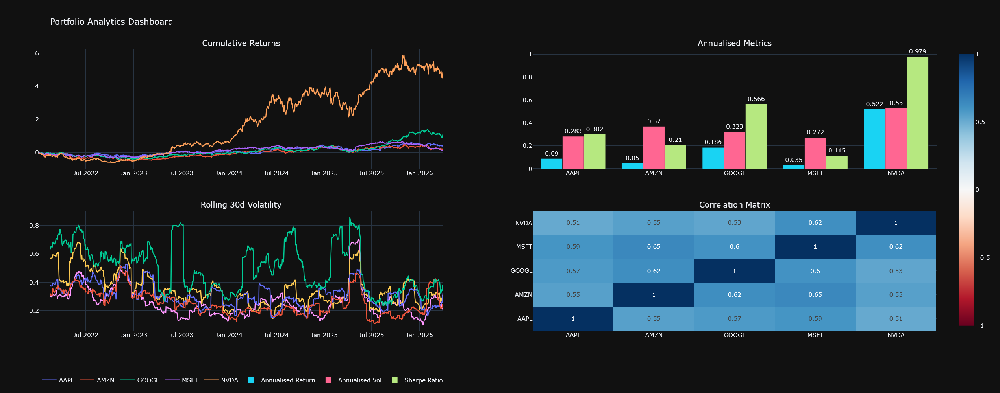

# Portfolio Analytics Dashboard

A Python tool that fetches real market data, calculates key portfolio metrics, and visualises them in an interactive dashboard.

## Features
- Fetches historical price data via yfinance and stores it in SQLite
- Calculates annualised return, volatility, Sharpe ratio, and max drawdown
- Renders an interactive 4-panel dashboard (cumulative returns, metrics, rolling volatility, correlation matrix)

## Technologies
Python, pandas, numpy, plotly, SQLAlchemy, SQLite, yfinance

## Installation
pip install yfinance pandas numpy plotly sqlalchemy

## Usage
python data_fetcher.py   # fetch and store data
python metrics.py        # calculate metrics
python dashboard.py      # launch dashboard

## Dashboard Preview
